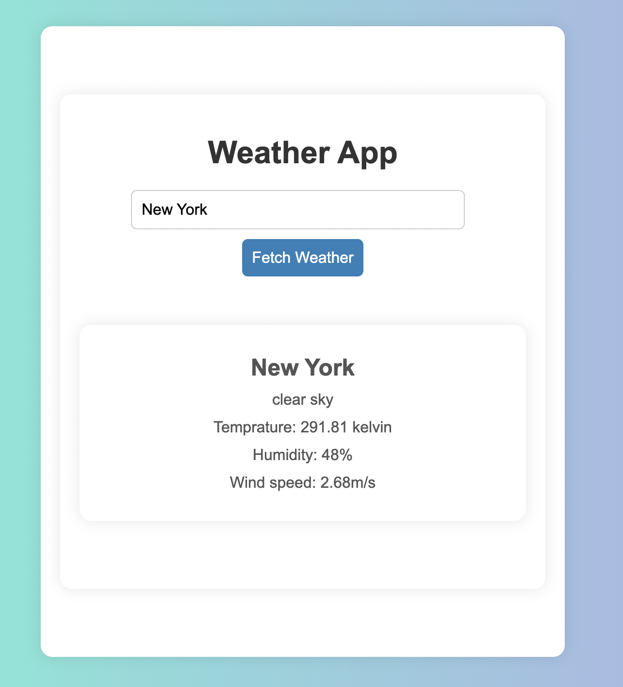

# 🌦️ React Weather App

This is a simple React application that allows users to fetch current weather data for any city using the OpenWeatherMap API.

## 🚀 Features

- Search weather by city name
- Displays:
  - City name
  - Weather description
  - Temperature (in Kelvin)
  - Humidity
  - Wind speed
- Loading indicator while fetching data

## 🛠️ Technologies Used

- React (with Hooks: `useState`, `useMemo`, `useCallback`)
- OpenWeatherMap API
- HTML/CSS for basic styling

---

## 📸 Screenshot



---

## 🚀 Getting Started Locally

1. **Clone the repository**
   ```bash
   git clone https://github.com/shardareddy12/weather-app.git
   cd weather-app

